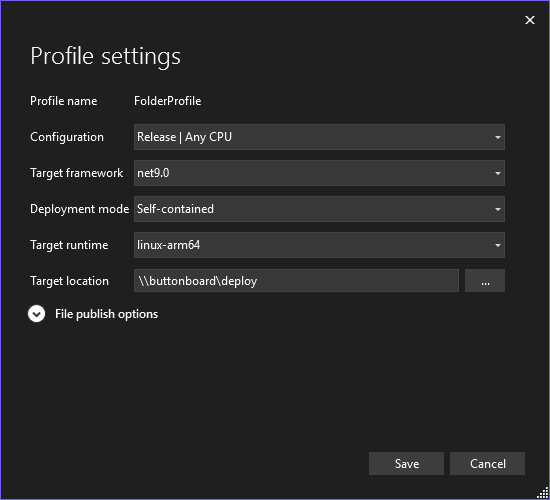

# 🎛️ Buttonboard – Entertainment Controlling System

The **Buttonboard** is a flexible control platform built with **.NET** and optimized for the **Raspberry Pi**.
It enables the design and execution of interactive entertainment scenarios, ranging from private home projects to live shows and installations.

Key features include:

- 🎛️ Device control for audio and video outputs
- 🌐 IoT integration via MQTT and REST APIs
- ⚡ Lightweight deployment with self-contained binaries, no runtime installation required
- 🛠️ Designed for extensibility, making it easy to add new scenarios or device types

Typical use cases:

- Interactive Halloween or stage shows
- Smart home entertainment control
- Rapid prototyping of IoT-driven experiences

---

## 🔧 Hardware

- **Raspberry Pi 3 B+** running Raspberry Pi OS (64-bit, Bookworm)  
- **4 control buttons** with integrated status LEDs  
- **9-segment LED process bar** for visual progress indication  
- Dedicated **“System Ready”** and **“System Warning”** LEDs  
- **Custom enclosure** with mounting hardware for reliable installation

## ⚡ Circuit & Wiring

### Buttons

| Button                   | Function      | GPIO (BCM) | Pin (Board) |
|--------------------------|---------------|------------|-------------|
| Button 1 (Top Center)    | Start Scene 1 | GPIO 13    | Pin 33      |
| Button 2 (Bottom Left)   | Start Scene 2 | GPIO 27    | Pin 13      |
| Button 3 (Bottom Middle) | Start Scene 3 | GPIO 4     | Pin 7       |
| Button 4 (Bottom Right)  | Start Scene 4 | GPIO 21    | Pin 40      |

### LEDs

| LED                     | Farbe  | GPIO (BCM) | Pin (Board) | Resistor |
|-------------------------|--------|------------|-------------|----------|
| LED 1 (Top Center)      | Green  | GPIO 16    | Pin 36      | 220Ω     |
| LED 2 (Bottom Left)     | Green  | GPIO 9     | Pin 21      | 220Ω     |
| LED 3 (Bottom Center)   | Green  | GPIO 26    | Pin 37      | 220Ω     |
| LED 4 (Bottom Right)    | Green  | GPIO 10    | Pin 19      | 220Ω     |
| LED 5 (Process 1)       | Red    | GPIO 23    | Pin 16      | 220Ω     |
| LED 6 (Process 2)       | Red    | GPIO 22    | Pin 15      | 220Ω     |
| LED 7 (Process 3)       | Red    | GPIO 12    | Pin 32      | 220Ω     |
| LED 8 (Process 4)       | Yellow | GPIO 20    | Pin 38      | 220Ω     |
| LED 9 (Process 5)       | Yellow | GPIO 19    | Pin 35      | 220Ω     |
| LED 10 (Process 6)      | Yellow | GPIO 24    | Pin 18      | 220Ω     |
| LED 11 (Process 7)      | Green  | GPIO 25    | Pin 22      | 220Ω     |
| LED 12 (Process 8)      | Green  | GPIO 5     | Pin 29      | 220Ω     |
| LED 13 (Process 9)      | Green  | GPIO 6     | Pin 31      | 220Ω     |
| LED 14 (System Ready)   | Green  | GPIO 17    | Pin 11      | 220Ω     |
| LED 15 (System Warning) | Yellow | GPIO 18    | Pin 12      | 220Ω     |


***LED Series Resistor Calculation:***
`Resistor = (GPIO voltage – LED forward voltage) / LED current`

**Example:**  
`R = (3.3V – 2.0V) / 0.010A = 130Ω`

👉 In practice, use the next higher standard resistor value (e.g., **150Ω** or **220Ω**) to ensure safe operation.

## 📦 Installation Guide

### 📥 Raspberry Pi OS (64-bit, Bookworm)

1. Flash **Raspberry Pi OS Bookworm (64-bit)** to a microSD card using the [Raspberry Pi Imager](https://www.raspberrypi.com/software/).

2. Insert the card into the Raspberry Pi 3 B+ and power it on.

3. Connect the Pi to **Wi-Fi** (via desktop GUI, `nmtui`, or `nmcli`) and enable **SSH**.

4. Update all system packages:

```bash
sudo apt update && sudo apt full-upgrade -y
```

✅ Your base system is now ready.

### 🌐 Install Buttonboard Runtime Environment

1. Copy the provided **Install.sh** script to your Raspberry Pi (e.g., via **SFTP**).

2. Run the installation script with root permissions:

```bash
sudo bash install.sh
```

The script will:

- Install all required dependencies
- Set up Webmin system administration tool
- Configure Samba shared folder for buttonboard app deployment
  
*(By default the app path is `/opt/buttonboard` on the Raspberry Pi and exposes it as a network share `\\buttonboard\deploy`)*

---

## 📦 Deployment & Execution of the Buttonboard App

### 1. Deployment  

The application is built using a **Publish Profile** and then transferred to the Buttonboard.



ℹ️ Note:
The deployment is performed as a self-contained deployment. All required libraries and the .NET runtime are included in the application package — no separate .NET installation is required on the Raspberry Pi.

### 2. Execution

After transferring the files to the Raspberry Pi, set the **execute permission** on the application binary:

```bash
chmod +x /opt/buttonboard/BSolutions.Buttonboard.App
```

You can then start the application with:

```bash
/opt/buttonboard/./BSolutions.Buttonboard.App
```

---

## 🐞 Debugging

Für das Debuggen gibt es zwei empfehlenswerte Ansätze:  

1. **Visual Studio-Erweiterung „Raspberry Debugger“**  
   👉 [RaspberryDebugger auf GitHub](https://github.com/nforgeio/RaspberryDebugger)  

2. **Remote Debugging via SSH**  
   👉 [Debuggen von .NET Core unter Linux mit SSH](https://learn.microsoft.com/de-de/visualstudio/debugger/remote-debugging-dotnet-core-linux-with-ssh?view=vs-2022)  

### Installation des Visual Studio Remote Debugger

[Weitere Informationen](https://github.com/nforgeio/RaspberryDebugger)