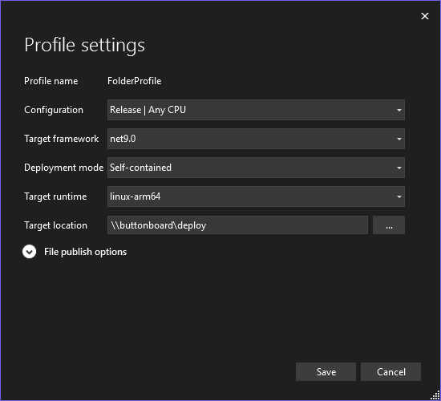

# 🎛️ Buttonboard – Entertainment Controlling System

The **Buttonboard** is a flexible control platform built with **.NET** and optimized for the **Raspberry Pi**.
It enables the design and execution of interactive entertainment scenarios, ranging from private home projects to live shows and installations.

Key features include:

- 🎛️ Device control for audio and video outputs
- 🌐 IoT integration via MQTT and REST APIs
- ⚡ Lightweight deployment with self-contained binaries, no runtime installation required
- 🛠️ Designed for extensibility, making it easy to add new scenarios or device types

Typical use cases:

- Interactive Halloween or stage shows
- Smart home entertainment control
- Rapid prototyping of IoT-driven experiences

---

## 📦 Installation Guide

The complete **installation guide**, as well as a list of the **necessary hardware and its wiring**, can be found in the documentation:

- [Documentation/Installation.md](./Documentation/Installation.md)
- [Documentation/Hardware.md](./Documentation/Hardware.md)

---

## 📦 Deployment & Execution of the Buttonboard App

### 1. Deployment  

The application is built using a **Publish Profile** and then transferred to the Buttonboard.



ℹ️ Note:
The deployment is performed as a self-contained deployment. All required libraries and the .NET runtime are included in the application package — no separate .NET installation is required on the Raspberry Pi.

### 2. Execution

After transferring the files to the Raspberry Pi, set the **execute permission** on the application binary:

```bash
chmod +x /opt/buttonboard/BSolutions.Buttonboard.App
```

You can then start the application with:

```bash
/opt/buttonboard/./BSolutions.Buttonboard.App
```
